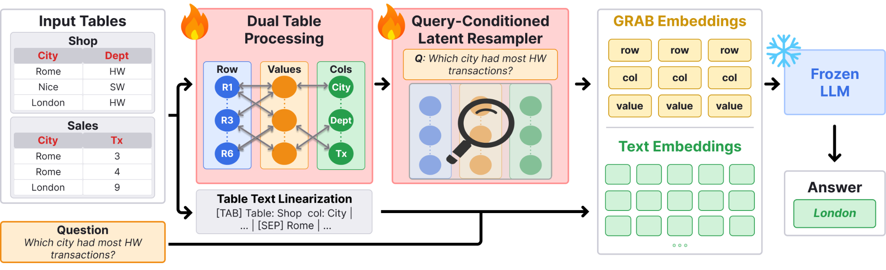

# GRAB — Latent Bridges for Multi-Table Question Answering

GRAB is a framework for table question answering and table-grounded reasoning. It encodes structured tables as tripartite graphs and injects the resulting embeddings into a frozen large language model (LLM), enabling the model to reason over complex tabular data.



---

## Models

| Key | Description |
|---|---|
| `base_llm` | Baseline: frozen LLM with linearised table in the prompt, no graph encoder. |
| `soft_prompt_llm` | Soft-prompt baseline: learnable resampler over a simple MLP encoder, no GNN. |
| `grab_single_table` | GRAB for single-table datasets. Full tripartite GNN + resampler. |
| `grab_multi_table` | GRAB for multi-table datasets. Adds a learnable table-ID embedding to R and C. |

---

## Datasets

| Key | Task type | Tables |
|---|---|---|
| `wtq` | Table QA | Single |
| `wikisql` | Table QA | Single |
| `structProbe` | Table QA | Single |
| `hitab` | Table QA | Single |
| `tabmwp` | Math over tables | Single |
| `hctqa` | Hierarchical table QA | Single |
| `multihiertt` | Multi-table QA | Multi |
| `scitat` | Scientific table QA | Multi |
| `mmqa` | Multi-modal multi-table QA | Multi |
| `tqa_bench` | Table QA benchmark | Multi |
| `atis` | Text-to-SQL (result table) | Multi |
| `geoquery` | Text-to-SQL (result table) | Multi |
| `spider_text2sql` | Text-to-SQL generation | Multi |
| `spider_qa` | Text-to-SQL (result table QA) | Multi |

---

## Repository layout

```
GRAB/
├── src/
│   ├── train_parallel.py          # DDP training + end-of-run evaluation
│   ├── test.py                    # Pure inference (no training)
│   ├── precompute_single_table.py # Precompute graph features for grab_single_table
│   ├── precompute_multi_table.py  # Precompute graph features for grab_multi_table
│   ├── config.py                  # All argument definitions
│   ├── global_path.py             # Loads .env → data_dir, model_dir, ckpt_dir, precomputed_graphs_root
│   ├── model/
│   │   ├── grab_models.py         # GrabSingleTable, GrabMultiTable
│   │   ├── gnn_encoder.py         # Tripartite GNN + K-token resampler
│   │   ├── baseline_llm.py        # base_llm
│   │   ├── soft_prompt_llm.py     # soft_prompt_llm
│   │   └── tokenizers.py          # TableTokenizerRow, MultiTableTokenizerSplitRow
│   ├── dataset/                   # One file per dataset + precomputed_wrapper.py
│   └── utils/
│       ├── collate.py             # collate_fn + collate_graph_batch (pads graph tensors in workers)
│       ├── ckpt.py                # Checkpoint save / reload
│       ├── evaluate.py            # Per-dataset evaluation functions
│       └── ...
├── script/
│   ├── train/
│   │   ├── grab_single_dataset.sh # Train grab_single_table on all single-table datasets
│   │   ├── grab_multi_dataset.sh  # Train grab_multi_table on all multi-table datasets
│   │   └── soft_prompt_all_datasets.sh
│   └── test/
│       └── baseline_llm_all_datasets.sh
├── script_slurm/
│   ├── train/                     # Individual SLURM jobs (one dataset each)
│   └── test/
├── .env                           # Paths (DATA_DIR, MODEL_DIR, CKPT_DIR, PRECOMPUTED_GRAPHS)
└── skip_list.json                 # Samples to exclude (token budget exceeded)
```

---

## Setup

### 1. Configure paths

Edit `.env` in the project root. All scripts source it automatically. The four variables control where data, models, checkpoints, and precomputed graphs are read from and written to:

**`DATA_DIR`** — HuggingFace datasets saved to disk. Each dataset follows the double-name convention:

```
$DATA_DIR/
  <dataset>/
    <dataset>/       ← HF dataset artifact (train/, validation/, test/)
```

**`MODEL_DIR`** — Local model weights:

```
$MODEL_DIR/
  Qwen/
    Qwen3-4B-Base/
    Qwen3-14B-Base/
    Qwen3-Embedding-0.6B/   
```

**`CKPT_DIR`** — Training outputs (checkpoints, predictions, scores). Defaults to `./checkpoints` relative to the project root:

```
$CKPT_DIR/
  train/
    grab_single/<dataset>/
    grab_multi/<dataset>/
    soft_prompt/<dataset>/
  test/
    base_llm/<dataset>/
```

**`PRECOMPUTED_GRAPHS`** — Precomputed graph features for GRAB models:

```
$PRECOMPUTED_GRAPHS/
  <dataset>/
    <run_name>/          ← e.g. precomputed_graphs_row_qwen_final
      train/
      validation/
      test/
      meta.json
```

### 2. Install dependencies

```bash
python -m venv .venv
source .venv/bin/activate
pip install -r requirements.txt
```

---

## Precomputing graph features

GRAB models require precomputed graph features. Run this once per dataset before training. Outputs are written to `$PRECOMPUTED_GRAPHS/<dataset>/<run_name>/`.

**Single-table datasets:**

```bash
torchrun --nproc_per_node=2 src/precompute_single_table.py \
    --dataset wtq \
    --gnn_base_model "Qwen/Qwen3-Embedding-0.6B" \
    --precomputed_graphs "$PRECOMPUTED_GRAPHS/wtq/precomputed_graphs_row_qwen"
```

**Multi-table datasets:**

```bash
torchrun --nproc_per_node=2 src/precompute_multi_table.py \
    --dataset mmqa \
    --gnn_base_model "Qwen/Qwen3-Embedding-0.6B" \
    --precomputed_graphs "$PRECOMPUTED_GRAPHS/mmqa/precomputed_graphs_row_qwen"
```

> If only one precomputed folder exists under `$PRECOMPUTED_GRAPHS/<dataset>/`, training auto-discovers it and `--precomputed_graphs` can be omitted.

---

## Training

All training runs use `torchrun` for multi-GPU DDP. Set `PROJECT_ROOT` and `PYTHONPATH` before launching:

```bash
export PYTHONPATH="$(pwd):$PYTHONPATH"
source .env
```

### GRAB — single-table

```bash
torchrun --nproc_per_node=2 src/train_parallel.py \
    --model_name grab_single_table \
    --dataset wtq \
    --multi_table False \
    --llm_model_name qwen3_4b \
    --llm_frozen True \
    --gnn_base_model "Qwen/Qwen3-Embedding-0.6B" \
    --num_gnn_layers 1 \
    --num_row_latents 32 --num_col_latents 32 --num_val_latents 32 \
    --num_resampler_layers 2 \
    --max_columns 512 --max_hash_groups 16384 \
    --lr 1e-4 --batch_size 2 --grad_steps 8 --num_epochs 10 \
    --output_dir "$CKPT_DIR/train/grab_single/wtq"
```

### GRAB — multi-table

```bash
torchrun --nproc_per_node=2 src/train_parallel.py \
    --model_name grab_multi_table \
    --dataset mmqa \
    --multi_table True \
    --llm_model_name qwen3_4b \
    --llm_frozen True \
    --gnn_base_model "Qwen/Qwen3-Embedding-0.6B" \
    --num_gnn_layers 1 \
    --num_row_latents 32 --num_col_latents 32 --num_val_latents 32 \
    --num_resampler_layers 2 \
    --max_columns 512 --max_hash_groups 16384 \
    --lr 1e-4 --batch_size 2 --grad_steps 8 --num_epochs 10 \
    --output_dir "$CKPT_DIR/train/grab_multi/mmqa"
```

### Soft-prompt baseline

```bash
torchrun --nproc_per_node=2 src/train_parallel.py \
    --model_name soft_prompt_llm \
    --dataset wtq \
    --llm_model_name qwen3_4b \
    --llm_frozen True \
    --num_latents 10 --num_resampler_heads 8 --gnn_hidden_size 1024 \
    --lr 1e-4 --batch_size 1 --grad_steps 16 --num_epochs 10 \
    --output_dir "$CKPT_DIR/train/soft_prompt/wtq"
```

### Bulk scripts

To train on all datasets at once use the scripts in `script/train/`:

```bash
bash script/train/grab_single_dataset.sh
bash script/train/grab_multi_dataset.sh
bash script/train/soft_prompt_all_datasets.sh
```

---

## Evaluation / Inference

For zero-shot evaluation of a frozen LLM or testing a trained checkpoint use `src/test.py`:

```bash
torchrun --nproc_per_node=2 src/test.py \
    --model_name base_llm \
    --dataset structProbe \
    --llm_model_name qwen3_4b \
    --llm_frozen True \
    --max_txt_len 8192 --max_new_tokens 128 \
    --output_dir "$CKPT_DIR/test/base_llm/structProbe"
```

Results (predictions CSV and `score.txt`) are written to `--output_dir`.

To evaluate all datasets at once:

```bash
bash script/test/baseline_llm_all_datasets.sh
```

---


## Key arguments

| Argument | Description |
|---|---|
| `--model_name` | `base_llm`, `soft_prompt_llm`, `grab_single_table`, `grab_multi_table` |
| `--dataset` | Dataset key from the table above |
| `--multi_table` | `True` for multi-table datasets, `False` otherwise |
| `--llm_model_name` | `qwen3_4b`, `qwen3_14b` |
| `--llm_frozen` | Freeze LLM weights (`True` / `False`) |
| `--llm_lora` | Apply LoRA to the LLM (`True` / `False`) |
| `--precomputed_graphs` | Folder name or absolute path to precomputed graph features |
| `--num_gnn_layers` | Number of tripartite message-passing layers |
| `--num_row_latents` | Latent tokens for row cross-attention |
| `--num_col_latents` | Latent tokens for column cross-attention |
| `--num_val_latents` | Latent tokens for value cross-attention |
| `--num_resampler_layers` | Cross-attention layers per latent group |
| `--max_columns` | Max columns for learnable column-type embeddings |
| `--max_hash_groups` | Size of the value-node hash buffer |
| `--skip_list` | Path to `skip_list.json` (samples exceeding token budget) |
| `--output_dir` | Where to write checkpoints, predictions, and scores |
